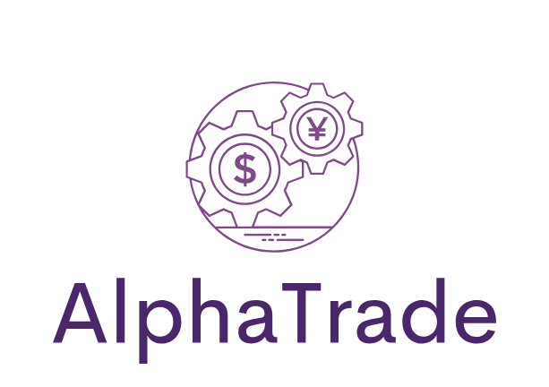
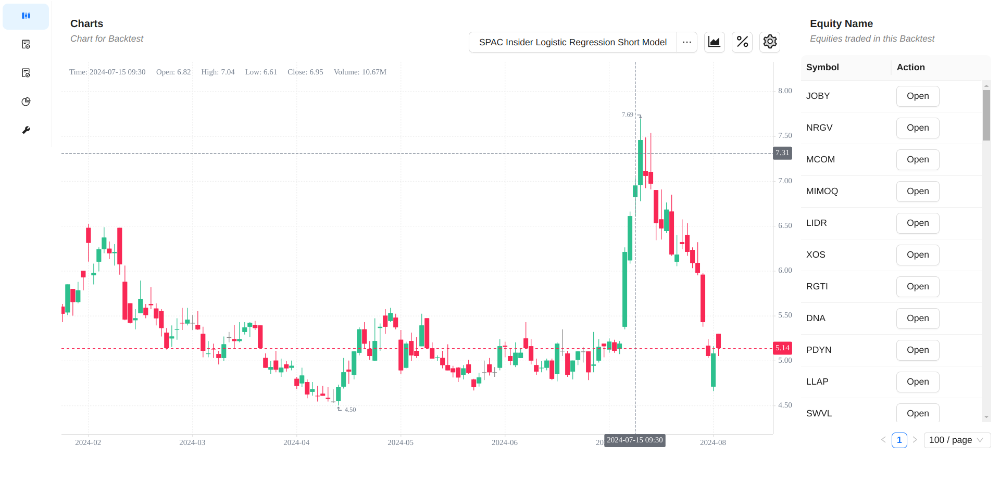
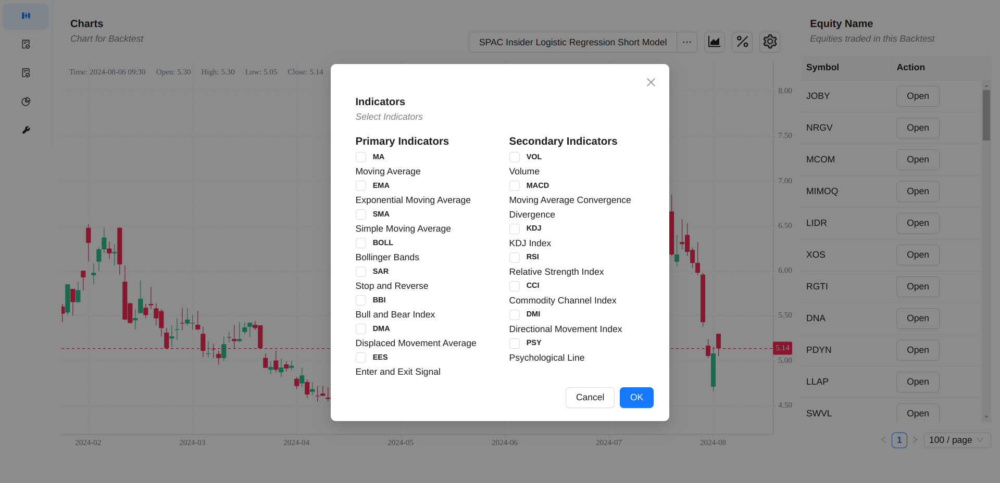
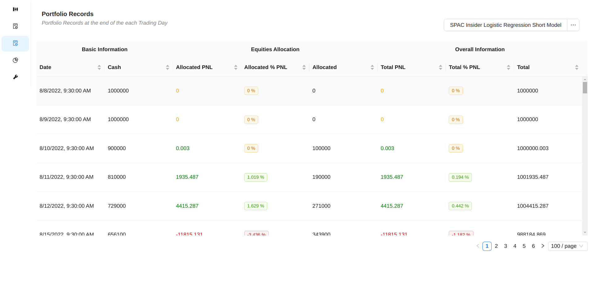
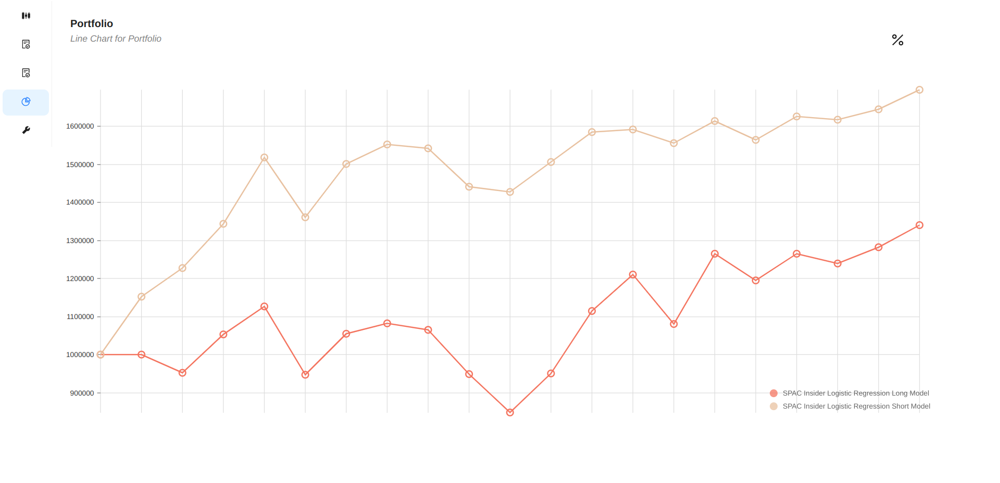
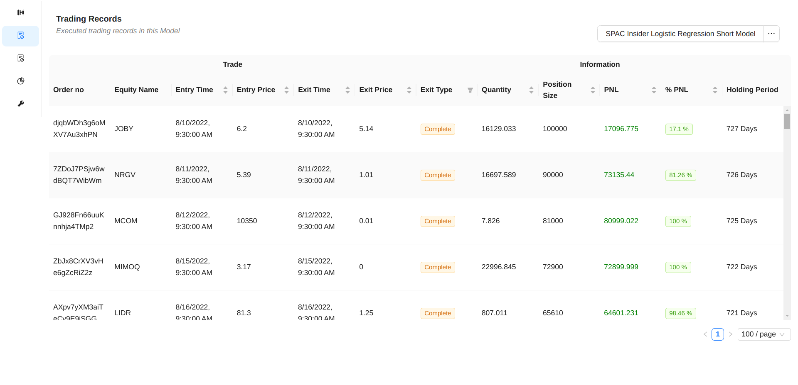
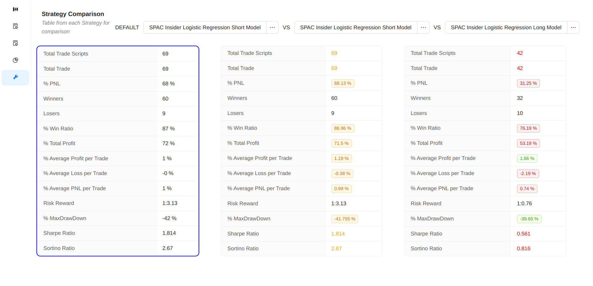

  
  
Open Source Backtester with React UI

 
 
 

 

<b>USE THIS SOFTWARE AT YOUR OWN RISK. THE AUTHOR ASSUMES NO LIABILITY FOR YOUR TRADING OUTCOMES.</b>

## 📖 Contents

- [Overview](#overview)
- [Features](#features)
- [Technologies](#technologies)
- [Getting Started](#getting-started)
- [Documentation](#documentation)
- [Customization](#customization)
- [Contribute](#contribute)
- [License](#license)

## 🔍 Overview <a id="overview" />

A few months ago I read some researches on [QuantConnect](https://www.quantconnect.com/). I was backtesting on jupternotebook for a long time. It was fascinating for me how the [QuantConnect Lean](https://github.com/QuantConnect/Lean) works. The idea of this project originally came from me building backtest for several strategies.

I was curious and wanted to scale it into a real framework or system that can log trades and daily portfolio for me. I had a lot of fun building this. I got to play with lots of different technologies while growing my financial knowledge.

Feel free to create issues or PRs for this repo if you have any additional questions. There are lots of fixes and features to be done!

_It is important to note that this project is under active development and was developed as an experiment. Currently, only [yahooFinance API](https://pypi.org/project/yfinance/) is supported but contributions are welcome!_

**Please leave a ⭐ as motivation if you liked the idea 😄**

## ✨ Features <a id="features" />

This system has lots of features such as:

- **Web UI**: Graphical representation of multiple information.

- **Configurable**: Supports assets and strategies customization easily without touching way less code!

- **Portable**: Most data is fetched at the start from running strategy model. Analysis on Web UI is done through local data.

- **Easy to upgrade**: Modify the system easily to your needs.

## ⚡️ Technologies <a id="technologies" />

 

## 🍕 Getting Started <a id="getting-started" />

Here we will setup our development environment. But first, we will need to install the following tools.

**Tools**

- [Node >= 18.15](https://nodejs.org/en/download/)
- [Python >= 3.10](https://www.python.org/downloads/)

**Steps**

- Once all the tools are installed, create a virtual python environment by `python -m venv ./venv` and `source ./venv/bin/activate` and install the dependencies in `requirements.txt` with `python -m pip install requirements.txt`.
- Go in the `web/` folder and install the dependencies through `npm` by `npm install`.
- Run the JupterNotebook script `backtester.ipynb` with `Run All` to generate the csv files and the json files needed by the `Web UI`
- Start web development with `npm start` command.

## 🛠 Customization <a id="customization" />

We can customize trading strategies either via the JupterNotebook directly.

Currently, only few trading strategies like RSI, MACD, MA Golden Cross are supported and I plan to add more soon.

More documentation in the [here](./docs/Documentation.md)

## 👏 Contribute <a id="contribute" />

Contributions are welcome as always, before submitting a new PR please make sure to open a new issue so community members can discuss it.

Additionally, you might find existing open issues which can help with improvements.

This project follows a standard [code of conduct](./CODE_OF_CONDUCT.md) so that you can understand what actions will and will not be tolerated.

## 📄 License <a id="license" />

This project is MIT licensed, as found in the [LICENSE](./LICENSE)
